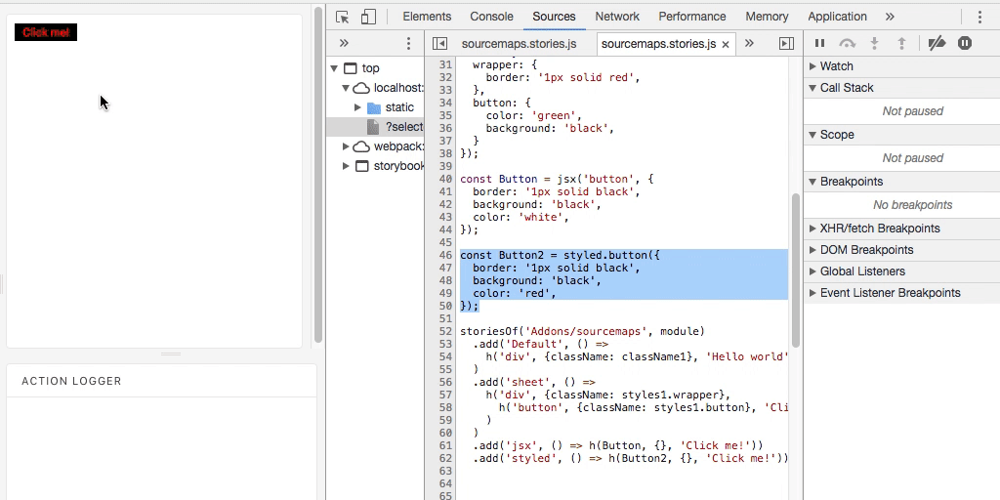

# `sourcemaps` Addon

Adds sourcempas in dev mode.



Do now use this addon in production. Check environment to exclude it from production:

```js
if (process.env.NODE_ENV !== 'production') {
    addonSourcemaps(nano);
}
```


## Installation

Simply install `sourcemaps` addon. Read more about the [Addon Installation](./Addons.md#addon-installation).
